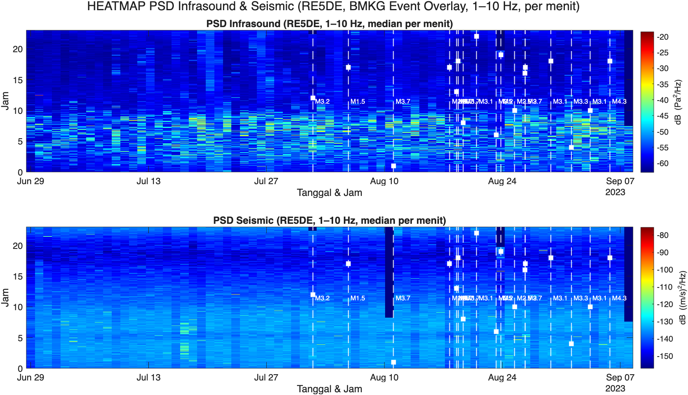

# Antenna-Merapi

**Antenna-Merapi** adalah repositori yang berisi data dan kode pemrosesan seismik dan infrasonik dari 5 stasiun yang terpasang di Gunung Merapi, Indonesia. Proyek ini adalah kolaborasi antara Laboratorium Geofisika UGM dengan [Gempa GmbH](https://www.gempa.de/) yang bertujuan untuk menampilkan, memilih, dan menganalisis event seismik dan infrasonik dengan pendekatan **array processing** ([Rost & Thomas 2002](https://agupubs.onlinelibrary.wiley.com/share/IUD8HQYPQ6KXF7W3V6RX?target=10.1029/2000RG000100)).


While volcanic infrasound is widely used for eruption detection and vertical jetting source characterization, the use of infrasound arrays for quantitative estimation of lateral pyroclastic density current (PDC) propagation—particularly the direction and velocity as the material flows down the volcano’s slopes—remains underexplored. Previous works have rarely focused on the challenge of differentiating PDC-related infrasound signatures from those of other eruptive or non-eruptive processes, especially in complex topography and in tropical volcano settings. There is a need for robust signal processing and array techniques to constrain the azimuthal direction and apparent velocity of PDCs using dense, small-aperture infrasound arrays, and for ground-truth validation with direct or video observations. This research aims to fill these gaps by developing quantitative methods for real-time detection and directional estimation of PDCs using infrasound array data at Mt. Merapi.
# Topik penelitian:
## 1. Array Analysis of Volcanic Infrasound and Seismicity
Studi beamforming/vespagram multi-event:
Penelitian spatiotemporal variasi sumber infrasound selama periode aktif—arah, kecepatan propagasi, dan hubungannya dengan morfologi kawah atau kolom erupsi.

Studi source migration:
Analisis dinamika lokasi sumber guguran piroklastik atau letusan dari array (mendeteksi perubahan posisi sumber dengan waktu).

Berikut adalah **prosedur lengkap** , **untuk data 5 stasiun infrasound** pada tanggal **25 Agustus 2023**.

---

## **Langkah-langkah Analisis (25 Agustus 2023):**

### 1. **Load dan Sinkronisasi Data**

### 2. **High-pass filtering (>1 Hz, 2nd order Butterworth)**

### 3. **Windowed cross-correlation semua pasangan stasiun**

### 4. **Ambil lag time maksimum**

### 5. **Inversi slowness vector (velocity & azimuth)**

---

# **Konsep Matematis Sederhana**

Misal:

* **Lintasan sumber:** $\vec{r}_s(t)$ *(fungsi waktu)*
* **Lokasi stasiun ke-**$k$: $\vec{r}_k$
* **Sinyal sumber:** $S(t)$

---

### **Delay arrival** ke stasiun- $k$ pada waktu $t$:

$$
\tau_k(t) = \frac{|\vec{r}_s(t) - \vec{r}_k|}{v}
$$

di mana $v$ = kecepatan propagasi infrasound.

---

* **Sinyal di stasiun $k$:**

$$
x_k(t) = \sum_{t' = t_0}^{t_1} S(t') \cdot \delta \left( t - [ t' + \tau_k(t') ] \right)
$$

*(Artinya: semua emisi di sepanjang lintasan, setelah delay sesuai jaraknya, diterima di stasiun $k$ pada waktu $t$)*

---


### 6. **Plot hasil sebagai fungsi waktu (VESPAgram)**

---


Keterangan gambar, kolom 1 sinyal infrasonik, kolom 2 RMS amplitudo infrasonik, kolom 3. Reliability sinyal dari array anlysis, kolom 4 azimuth arah sinyal, warna merah menghighlight yang around 0 derajat (arah puncak Merapi), kolom 5 velocity sinyal, warna merah menghighlight kecepatan suara, kolom 6 - 9 time lag correlation antara statiun UGM 1 s/d 5 perhatikan yang around time lag 0 detik mempunyai koherensi sinyal yang tinggi.
## Zoom 15 menit mulai 16:05 UTC 


Perhatikan kriteria infrasound signal diantaranya adalah kecepatan rambatnya yang ~ 337 - 370 m/s (kecepatan gelombang suara)

## 2. Multi-Physical Correlation (Seismic-Infrasound)
Korelasi seismik-infrasound:
Studi relasi antara timing dan karakteristik sinyal seismik dan infrasound untuk setiap event.
Apakah semua event infrasound diikuti seismik, dan sebaliknya?

Constraint on Source Depth:
Model timing difference infrasound vs seismik untuk memperkirakan kedalaman sumber atau mekanisme sumber.

## 3. Eruption Source Mechanism & Classification
Classification using machine learning:

Klasterisasi otomatis waveform (seismik dan infrasound) untuk membedakan tipe erupsi: guguran, letusan eksplosif, degassing, dsb.

Moment tensor/pressure pulse modeling:

Model parameter fisik sumber letusan menggunakan data array multi-instrument.

## 4. Real-Time Early Warning Demonstration
Prototype real-time detection:

Tunjukkan (simulasi atau nyata) sistem deteksi dan klasifikasi otomatis berbasis array, misal untuk Early Warning guguran atau letusan.

Performance analysis:

Evaluasi ketepatan/lead-time deteksi multi-event dibanding sistem resmi.

## 5. Propagation and Atmospheric Effects
Studi atmosfer dinamis:

Analisis perubahan kecepatan propagasi infrasound harian (pengaruh suhu, angin, dsb) menggunakan velocity dari array.

Sound scattering and attenuation:

Studi efek morfologi kawah/gunung terhadap bentuk sinyal dan atenuasi.

## 6. Long-term Statistical Event Analysis
Statistik dan katalog otomatis:

Buat katalog letusan/guguran untuk seluruh periode, analisis frekuensi, clustering waktu, dan hubungkan dengan parameter lain (cuaca, visual, dst).

Event rate vs. weather:

Korelasikan event dengan data cuaca, tekanan udara, kelembaban (jika tersedia).

## 7. Seismo-acoustic Source Relocation
Relokasi sumber event:

Kombinasikan data waktu tiba (arrival) dari seismik dan infrasound untuk mengestimasi lokasi sumber 3D secara lebih presisi.


---

## 📁 Struktur Repositori

```
Antenna-Merapi/
│
├── Data/
│   ├── seismic/           # Data mentah seismik (MiniSEED, SAC, dll.)
│   └── infrasound/        # Data mentah infrasonik
│
├── Code/
│   ├── view_event.py      # Menampilkan sinyal event
│   ├── cut_event.py       # Memotong sinyal berdasarkan waktu event
│   ├── select_event.py    # Antarmuka atau skrip pemilihan event penting
│   ├── array_processing.py# Beamforming atau FK analysis
│   └── utils/             # Fungsi bantu (filtering, plotting, dll.)
│
├── Manuscript/
│   └── Paper-paper related to infrasonic or antenna project  # Contoh analisis interaktif
│
└── README.md
```

---

## 📌 Fitur Utama

- ✅ **Menampilkan event** dari data mentah seismik dan infrasonik

   

- ✂️ **Memotong event** berdasarkan waktu atau katalog [dengan m-file bukti_potong_pajak.m]<br>

 
- ⭐ **Memilih event** untuk dianalisis lebih lanjut
- 📡 **Array processing** (beamforming, FK analysis) untuk estimasi arah datang dan kecepatan fasa


- 📊 Visualisasi waveforms, array response, dan peta polar
- Generate Synthetic Signal and Beamforming

  

  

Input backazimuth: 120.0 deg, output estimate: 120.4 deg
Input slowness: 0.667 s/km, output estimate: 0.679 s/km
---
### Real earthquake event
Real data Event tanggal 5 September 2023, M 4.3 2023-09-05	18:33:29	posisi hiposenter di Lat -8.60, Lon	110.06 depth 25 km
  

---

## 🔧 Persyaratan

### MATLAB
Repositori ini juga mendukung lingkungan MATLAB (Code telah ditest dengan MatlabR2025a) untuk pemrosesan data seismik dan infrasonik. Pastikan Anda memiliki MATLAB dengan toolbox berikut:
- Signal Processing Toolbox
- Mapping Toolbox
- Statistics and Machine Learning Toolbox
- Deep Learning Toolbox
- Wavelet Toolbox

### Python (Under Construction)
- Python ≥ 3.8
- Paket yang diperlukan:
  - `obspy`
  - `numpy`
  - `matplotlib`
  - `scipy`
  - `pandas`
  - `pyproj`
  - (opsional) `ipympl` untuk interaktivitas

Install dependencies:

```bash
pip install -r requirements.txt
```

---

<!--## 🚀 Cara Menggunakan

### 1. Menampilkan Event
```bash
python scripts/view_event.py --start 2023-08-25T16:00:00 --end 2023-08-25T17:00:00
```

### 2. Memotong Event
```bash
python scripts/cut_event.py --catalog catalog.csv --margin 30
```

### 3. Memilih Event
```bash
python scripts/select_event.py --input_folder cut_data/
```

### 4. Array Processing
```bash
python scripts/array_processing.py --method fk --channel EHZ --start 2023-08-25T16:10:00 --end 2023-08-25T16:15:00
```
-->
---

## 📌 Catatan

- Penamaan stasiun mengacu pada kode Raspberry Shake atau Raspberry Boom.
- Semua waktu menggunakan **UTC**.
- Kode ini dikembangkan untuk mendukung riset mitigasi erupsi Merapi berbasis data real-time.

---

## 📚 Lisensi

MIT License © 2025 Wiwit Suryanto – Universitas Gadjah Mada

---

## 📬 Kontak

Wiwit Suryanto  
Geophysics Research Group, FMIPA UGM  
✉️ ws@ugm.ac.id  
🌐 https://physics.ugm.ac.id

 [Wiwit](https://www.linkedin.com/in/wiwit-suryanto-10567711/)


